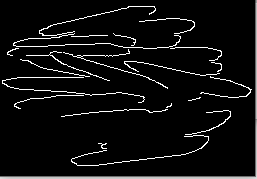

# Editor de imágenes basado en OpenCv
 
El presente trabajo tiene por objetivo realizar la implementación de manipulación de imágenes utilizando OpenCv.


* Dependencias:
   - cv2(opencv-python)
   - PIL
   - numpy
   - matplotlib
   - scipy
   - pylab
   - tkinter
   - scikit-image
   - nt_toolbox

 

### Uso:

Ejecutar:
```python
python editor.py
```
1. Seleccionar una imagen a la cual deseamos aplicar losmfitlros vía el menú Abrir
1. Seleccionar alguno de los filtros según los menús respectivos
   - Se abrira la imagen original y la imagen modificada
   - 
   - 
   - Algunos de los filtros dependeran de los valores ingresados en los controles deslizables
   
### Funciones implementadas

1. Procesamiento Global
   - Estructura .bmp: Visualiza por consola la estructura de la imagen BMP
   - Rgb a grises
   - Modificar Contraste - utilizar la barra de contraste 
   - Ecualizar
   - Brillo - utilizar la barra de control
   - Umbralizar - utilizar la barra de control

1. Transformaciones Locales
   - Suavizar
   - Filtro Promedio - utilizar la barra de control
   - Difuminación - utilizar la barra de control
   - Bordes
   - Filtro Sobel - utilizar la barra de control
   - Filtro Laplace
   - Filtro Gaussiano - utilizar la barra de control para    modificar el kernel
   - Filtro Mediana  - utilizar la barra de control
   - Dilatada - utilizar la barra de contraste
   - Erosionada - utilizar la barra de contraste
   - Cierre - utilizar la barra de control para  modificar el kernel
   - Apertura - utilizar la barra de control
   - Esqueletizada

1. Transformaciones Geométricas

   - Rotación - utilizar la barra de control
   - Traslación
   - Transformación afin

1. Dominio Frecuencial

   - Transformada Wavelet

